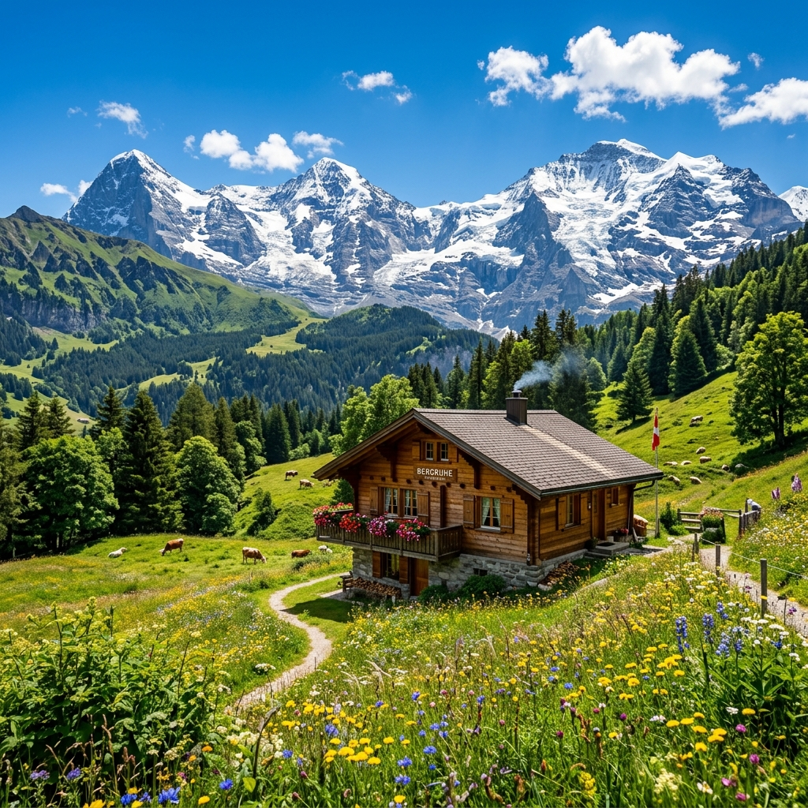

# ✈️ Tatheer Tours & Travels

<p align="center">
  
</p>

<p align="center">
  
  
  
  
  
</p>

---

## 🌟 Welcome to Tatheer Travels

Tatheer Tours & Travels is a high-end, premium tourism landing page website featuring custom layouts, rich glassmorphism UI overlays, micro-animations, and complete responsive design. Crafted specifically to invite travelers to discover the world's most beautiful secrets.

## 🚀 Key Features

*   **🌍 Globe Preloader Screen**: A custom fullscreen load screen featuring a pulsing gold globe, rotating teal loader ring, and shimmering typography to create a polished transition.
*   **📱 100% Mobile Responsive**: Seamless visual grid adjustments tailormade for Laptops, Portrait Tablets, Landscape Mobiles, and Foldables (tested down to 360px).
*   **⚡ Live Tour Package Filter**: Instant dynamic filter tags to sort destinations instantly without page reloads.
*   **🔮 Glassmorphic UI Widgets**: Search engine overlays, dropdown selects, and a trip-planner block styled with elegant light transparency blur elements.
*   **🧙 Smart Travel Planner**: Enter your core vibe, duration, and budget to get a matching vacation recommendation card.
*   **📖 Day-by-Day Dynamic Modal**: Click "Explore" on any destination to open an overlay panel displaying specific multi-day itineraries, locations, ratings, pricing, and a secure reservation form.
*   **⭐ Traveler Stories Carousel**: Customer reviews slider with automatic rotation and custom bullet controls.

---

## 📸 Curated Destination Showcase

Here are some of the popular packages featured in the website:

| 🏔️ Mountains & Glaciers | 🏖️ Beach & Islands | 🏺 Historical & Cultural |
| :---: | :---: | :---: |
| **Hunza Valley, Pakistan** <br/>  | **Maldives Resorts** <br/>  | **Kyoto Pagodas, Japan** <br/>  |
| **Swiss Alps Chalets** <br/>  | **Santorini Caldera, Greece** <br/>  | **Cappadocia Balloons, Turkey** <br/>  |

---

## 📁 Repository Structure

```
├── assets/                     # Curated high-resolution visual assets
│   ├── hero-bg.png             # Premium sunset forest hero image
│   ├── dest-hunza.png          # Hunza Valley tour card image
│   ├── dest-maldives.png       # Maldives water villas image
│   ├── dest-swiss.png          # Zermatt chalet image
│   ├── dest-santorini.png      # Santorini sunset image
│   ├── dest-cappadocia.png     # Cappadocia ballooning image
│   └── dest-kyoto.png          # Kyoto cherry blossom pagoda image
├── index.html                  # Semantic structural markup & meta SEO configurations
├── style.css                   # Custom responsive layouts & animations stylesheet
└── app.js                      # Smart matching widgets, modal actions & filtering handlers
```

---

## ⚙️ How to Run Locally

1. Clone this repository to your local drive:
   ```bash
   git clone https://github.com/00tatheer00/tatheer-travels.git
   ```
2. Open `index.html` in your web browser of choice, or run a simple local HTTP server:
   ```bash
   # Using Python
   python -m http.server 8000
   
   # Using Node.js
   npx http-server
   ```
3. Navigate to `http://localhost:8000` to review the interactive animations and loader transitions live.
